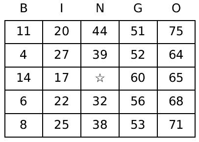

# Bingo

## General Information
This repository contains a script for generating standard or custom bingo cards and a script to call the values as during game play. The scripts are written in python. If no arguments are given to the scripts, the defaults are to use standard bingo cards. The original intent of this code was to create a review game for an English as a Second Language (ESL) class I was volunteer teaching. This code requires python3. The bingo cards are produced using [Matplotlib](https://matplotlib.org) tables.

## Contents
1. [Making bingo cards](#making-bingo-cards)
2. [Playing bingo](#playing-bingo)

## Making bingo cards
___
`make_bingo_cards.py` prints the bingo playing cards to a PDF file. 
The usage is: 
`make_bingo_cards.py [OPTIONS] nCards`

### Required parameters
* `nCards` is the number of cards to generate.

### Options
* `--card-file` is the name of the PDF file of generated bingo cards. The default name is "bingo_cards.pdf".
* `--card-size` is the number of rows and columns of each card. Valid values are (no quotes): "3x3", "4x4" and "5x5". The default value is "5x5".
* `--cards-per-page` is the number of bingo cards per printed page. Valid values are: 1, 2, and 4. The default value is 4.
* `--card-title` is the title on each bingo card.
* `--column-labels` is a comma-delimited string where value(s) between commas are used as the card column labels. The default value is (no quotes): "B,I,N,G,O".
* `--column-labels-off` is an option to not print column labels on the card.
* `--multiline-font-size` is the font size of the text that is spread out on multiple lines of a card space. Text on a single line is automatically sized to fit in the card spaces, but text on multiple lines is not. The default font size is 12.
* `--no-free` is an option to not make the center space of each card a free space. If using a card size of "4x4", the free space is randonly chosen.
* `--scatter` is an option to scatter card values around the card. The default is to randomize values within each column.
* `--value-file` is a path to a text file containing values to use for the bingo card spaces. The format can be one card space value per line OR to use specific values for specific columns, each line is: column name::space value, such as: B::1, B::2, ..., N::74, N::75.

### Standard bingo card
Made using the default options. 

### Custom bingo card

___

## Playing bingo
`draw_bingo_values.py` is used to draw (call) bingo numbers or game play values. For the custom card shown above, slides containing pictures of the words were shown to the players when the corresponding word was drawn.

### Options
* `--card-size` is the number of rows and columns of the bingo cards used. Valid values are (no quotes): "3x3", "4x4", and "5x5". The default value is "5x5". This option cannot be used with the `--value-file` option.
* `--value-file` is the path to a text file containing values that correspond to spaces of the players' bingo cards that will be spoken by the bingo caller. The format is one bingo card space value per line optionally prefixed by a column label. Example: 1, 2, ..., 74, 75 OR B::1, B::2, ..., N::74, N::75 (if using column labels). This option cannot be used with the `--card-size` option.
